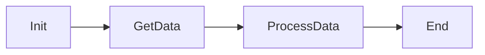
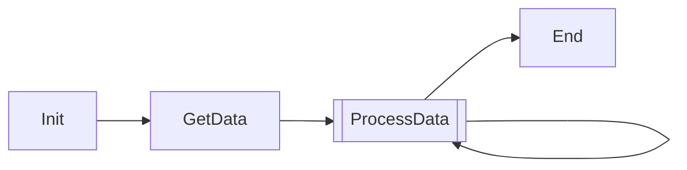
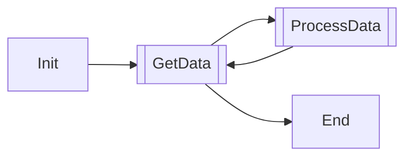
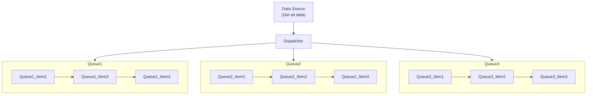
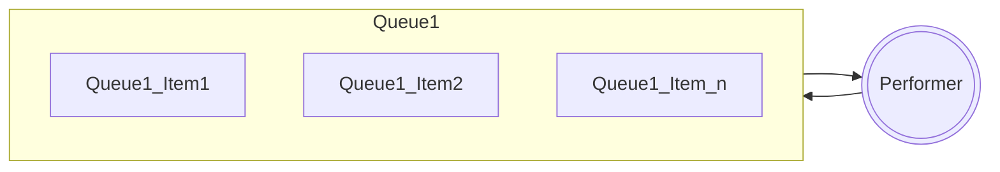

# Notas de repositorio

La intención de este repositorio es conocer las partes esenciales para desarrollar un RPA con PAD. 
Desde su inicio hasta su final pasasndo por las exceptiones y el procesamiento de información. 

# Documentación

**Notas RPA**

Los pasos esenciales para realizar un RPA con PAD. Es necesario conocer algúna metodología para realizar algún proyecto usando PAD, así como en UiPath que existe su conocido ReFramework, en este entorno tendremos que seguir un estándar similar para evitar errores en la programación. 

## Organización de los archivos en el MainFolder

Cada proyecto tendrá un espacio en donde colocaremos toda la información necesaria así como los archivos necesarios para correr el proyecto correctamente:

**RPA_FOLDER_NAME**
+  Data
+ + Input
+ + Output
+ + ConfigFile.xlsx
+ Docuementation [uso de librerías y más herramientas externas]
+ Esception_Screenshots
+ Tests
+ Main [RPA_NAME].pad
+ Readme.md

## Organización de los subFlujos [Recomendación]

Como sugerencia para organizar los subflujos, podemos inicialmente crear algunos que nos pueden ayudar a tener un ambiente más estable, como tipo plantilla. Los sublujos actualmente no se pueden guardar a parte o fuera del proyecto principal por lo que tenemos que guardar uno con todos los subflujos dentro. 

| Nombre de subflujo | Importancia | Notas |
| --- | --- | --- |
| InitAllApplication | I | Inicia las aplicaciones |
| CloseAllApplication | I | Cierra las aplicaciones |
| GetTransactionData | I | Obtiene la información para trabajar |
| InitAllSettings | I | Lee los archivos necesarios y settea las variables |
| KillAllProcess | Op | Mata todos los procesos, puede ser necesario o no, a considerar |
| Process | I | Procesa, analiza, realiza acciones con la información  |
| RetryCurrentTransaction | Op |  |
| SetTransactionStatus | Op |  |
| TakeScreenshot | I | Siempre tiene que estar presente en caso de que algo falle, es parte de las excepciones |
|  |  |  |

Es importante recordar que existen 3 principales tipos de Procesos de transferencia de información.

Iniciamos con los procesos **Lineales** en donde cada etapa del proceso son ocupados una sola vez, y si es necesario hacer algún paso del proceso otra vez, entonces todo el proceso completo se tendrá que repeir, como ejemplo tenemos _enviar un correo por email_. A continuación un esquema visual del proceso lineal.



Tenemos igual los proceos **iterativos** en donde los procesos pueden ser ejecutados multiples veces, siendo la información que transforman la que cambia en cada iteración. Un ejemplo común puede ser un contador, otro ejemplo puede ser que un mensaje sea enviado en un solo proceso a multiples destinatarios. A continuación un ejemplo de un proceso iterativo. 




Finalmente tenemos los procesos **Transaccionales**, son similares a los Iterativos en el sentido de que los procesos pueden ejecutarse más de una vez siempre con diferente información, **este tipo de proceso es el más común en los RPAs desatendidos**. A continuación un diagrama de un proceso transaccional. 




## Organización de las variables

Es importante para un proyecto de RPA poder rastrear con facilidad todas las variables que son creadas durante el desarrollo del proyecto, así como aquellas variables que son parte de nuestro Template

Las variables las podemos encontrar como **Globales** y **Locales**. La forma para organizar las variables será de la siguiente manera. 

| Nombre de la variable | Tipo de variable | Subflujo de creación | Aparición en subflujos | Descripción | Valor Inicial |
| --- | --- | --- | --- | --- | --- |
|  |  |  |  |  |  |
| UsuarioServiceNow | Texto | InitAllSettings | InitAllSettings | ServiceNow user name | user123@contoso.com |
| PassServiceNow | Password | InitAllSettings | InitAllSettings | ServiceNow user Password | InitAllUsers..12345 |
|  |  |  |  |  |  |

```
El contenido de la tabla anterior es de ejemplo
```


Para terminar con las reglas básicas, recordamos algunas buenas prácticas para la programación:

+ Colocar las variables y funciones con nombres **descriptivos**.	
+ Colocar el nombre de las variables usando PascalCase.
+ Colocar comentarios o notas al inicio y al final de cada subflujo [Descrivir el proceso].
+ Siempre encontraremos documentación en nuestro Repositorio sobre las funciones y estructura de nuestra plantilla.
+ *Cada función tiene una única funcionalidad*. Es recomendable dividir el código en sub procesos aún más simples en caso de ser necesario.
+ Mantener la documentación del proyecto en su respectivo **BotProcedura**, en el **Readme**, en el **Jira Backlog**.


### INICIO  

Al inicio de cada automatización o programa, es necesario hacer algunos pasos iniciales para el correcto funcionamiento del mismo. 
Es necesario primieramente settear algunas variables, reconociendo su tipo y fuente, así como una idea de su posible posterior tratamiento. 

Igualmente es necesario inicializar algunas aplicaciones como el navegador web, un documento de excel o alguna aplicación interna de la empresa. 

A continuación se describen algunas de las funciones que nos ayudan con esta etapa del desarrollo. 

**Definir variables que se necesiten** 

| Nombre de Acción | Qué hace | Notas |
| --- | --- | --- |
| Set variable | Establecer variable |  | 
| Create new List | Crear nueva lista |  | 
| Create new DataTable | Crear nueva Tabla de datos |  | 
|  |  |  | 

**Abrir los archivos y aplicaciones**

En algunas ocaciones es necesario colocar información extra cuando se usan las funcioens siguientes, como por ejemplo cuando se inicia un nuevo Excel, 
es necesario indicar la ruta en donde se quiere iniciar el archivo para crearlo o con un nombre ya predeterminado. 

| Nombre de Acción | Qué hace | Notas |
| --- | --- | --- |
| Iniciar nuevo Firefox / Chrome / MS Edge | Inicia una nueva estancia de navegador |  | 
| Iniciar Excel |  |  | 
| Iniciar Word |  |  | 
| Iniciar Outlook |  |  | 
| Iniciar SAP |  |  | 
|  |  |  | 

Excepciones


### PROCESAMIENTO

En la parte del procesamento de información tenemos algunas fundamentales dependiendo para cada tipo de dato. 
Por ejemplo, cuando estamos trabajando con cadenas de texto, podemos hacer uso de un RegEx para obtener el texti necesario, 
o podemos, igualmente, hacer uso de otras herramientas como Cortar, Buscar, Filtrar, etc. 
También cuando trabajamos con trablas podemos agregar registros completos, modificarlos o eliminarlos, dependiendo el requerimiento. 

A continuación mostramos algunas acciones que nos ayudan con el tratamiento de la información. 

| Módulo - Tipo de dato | Función | Qué hace | Notas |
| --- | --- | --- | --- |
| **Tabla** | Crear nueva tabla |  |  |
|  | Insertar FILA en tabla de datos |  |  |
|  | Eliminar FILA en tabla de datos |  |  |
|  | Actualizar elemento de la tabla de datos |  |  |
|  | Buscar o remplazar en la tabla de datos |  |  |
|  | Insertar COLUMNA de la tabla de datos |  |  |
|  | Eliminar COLUMNA de la tabla de datos |  |  |
|  | Eliminar Filas Vacías de la tabla de datos |  |  |
|  | Eliminar Filas duplicadas de la tabla de datos |  |  |
|  | Borrar la tabla de datos |  |  |
|  | Ordenar la tabla de datos |  |  |
|  | Filtrar la tabla de datos |  |  |
|  | Combinar las tablas de datos |  |  |
|  | Convertir la tabla de datos en Texto |  |  |
| **Texto** | Anexar línea de texto |  |  |
|  | Obtener sub texto | Sirve para  |  |
|  | Recortar texto | Sirve para |  |
|  | Rellenar texto |  |  |
|  | Invertir texto |  |  |
|  | Cambiar Mayúsculas y minúsculas de texto |  |  |
|  | _Convertir texto en número_ |  |  |
|  | _Convertir número en texto_ |  |  |
|  | _Convertir DateTime en texto_ |  |  |
|  | Crear texto aleatorio |  |  |
|  | Unir texto |  |  |
|  | Dividir texto |  |  |
|  | Analizar Texto |  |  |
|  | Reemplazar texo |  |  |
|  | Reconocer entidades en el texto | Analiza un texto e identifica parámetros simples como La **fecha** |  |
| **Excel** | Leer en Hoja de cálculo de Excel |  |  |
|  | Obtener celda activa en la hoja de cálculo de Excel |  |  |
|  | Guardar Excel |  |  |
|  | Escribir en la hoja de cálculo de Excel |  |  |
|  | Establecer la hoja de cálculo de Excel activa |  |  |
|  | Agregar nueva hoja de cálculo |  |  |
|  | Obtener la primera columna/fila libre en la hoa de cálculo de Excel |  |  |
|  | Obtener nombre de la columna en la hoja de cálculo de Excel |  |  |
|  | Borrar celdas en la hoja de cálculo de Excel |  |  |
|  | Ordenar Celdas en la hoja de cálculo de Excel |  |  |
|  | Filtrar celdas en la hoja de cálculo de Excel |  |  |
|  | Borrar filtros en la hoja de cálculo de Excel |  |  |
|  | Obtene celda vacía |  |  |
| **Gestión de carpetas** | Si la carpeta existe |  |  |
|  | Ibtener archivos de la carpeta |  |  |
|  | Obtener subcarpetas de la carpeta |  |  |
|  | Crear carpeta |  |  |
|  | Eliminar carpeta |  |  |
|  | Copiar carpeta |  |  |
|  | Mover carpta |  |  |
|  | Cambiar el nombre de la carpeta |  |  |
|  | Obtener carpeta especial |  |  |
|  |  |  |  |

Existen las acciones en el Navegador que son muy utilizdas cuando necesitamos ingresar a un portal web para obtener información o realizar alguna tarea repetitiva como ingresar información de registro. A continuación vemos algunas de las acciones más importantes que PAD nos ofrece para el procesamiento de información dentro de un entorno Web. 

| Campo | Acción | Función | Notas |
| --- | --- | --- | --- |
| **Extracción de datos web** | Extracción de datos de la página web |  |  |
|  | Realizar captura en pantalla de la página web |  |  |
| **Rellenado de formualrios web** | Rellenar campo de texto en la página web |  |  |
|  | Establecer el estado de la casilla en la página web |  |  |
|  | Seleccionar botón de radio en la página web |  |  |
|  | Establecer valor de lista desplegable en la página web |  |  |
|  | Presionar botón en la página web |  |  |
| **Generales** | Esperar el contenido de la página web |  |  |
|  | Si la página web contiene |  |  |
|  | Crear nueva pestaña |  |  |
|  | Ir a la página |  |  |
|  | Hacer click en un vinculo en una página web |  |  |
|  | Ejecutar la función de _Java Script_ en la página web |  |  |
|  | Despazar el mouse sobre un elemento de la página web |  |  |
|  |  |  |  |

``` Java
Es posible obtener información de tablas dentro de un entorno web, solamente es neccesario hacer la configuración correcta de los selectores para identificar correctamente la tabla
```


Igualmente existen formas para trabajar con la información a través de bucles, y otras formasd de contro de informaciín, como condicionales, en los que encontramos los siguientes:
_Podemos hacer referencia a cómo funcionan con los lenguajes de programación más comunes como Python, Java, JS, C_

| Nombre de Acción | Qué hace | Notas |
| --- | --- | --- |
| **Condicionales** | IF |  | 
|  | IF-ELSE |  | 
|  | ELSE |  | 
| **Bucles** | Bucle - Loop |  | 
|  | Condición de bucle |  | 
|  | For Each |  | 
|  | Salir del Bucle |  | 
|  | Siguiente bucle |  | 
| **Control de flujo** | Comentario |  | 
|  | Detener flujo |  | 
|  | Ejecutar subflujo |  | 
|  | _En error del bloque_ |  | 
|  | End |  | 
|  | Esoera |  | 
|  | Etiqueta |  | 
|  | Ir A |  | 
|  | Obtener el último error |  | 
|  | Región |  | 
|  | Región final |  | 
|  | Salir del flujo |  | 
| **Sistema** | Esperar al proceso | Son relacionadas a las aplicaciones de escritorio [Calculadora] | 
|  | Si el proceso |  | 
|  | Ejecutar aplicación |  | 
|  | Finalizar el proceso |  | 
|  | Ping |  | 
|  | Establecer variable de entorno Windows |  | 
|  | Obtener variables de entorno Windows |  | 
|  | Eliminar variable de entorno Windows |  | 
|  |  |  | 


Algunas otras más funciones que podemos ahcer uso es dentro de entornos y herramientas como las siguientes:

| Nombre | Notas |
| --- | --- |
| SAP | EPR empresarial para gestión de inventario |
| Azure | Herramienta Cloud para gestión de diferentes entornos y servicios |
| AWS | Azure Web Services |
| OCR | Herramienta de visión artificial para analizar imágenes |
|  |  |

```
Igualmente es importante recordar que estas son funciones estándar, pero que igualmente existen más funciones a las que podemos acceder con una licencia de desarrollador.
```


Excepciones


### CIERRE

Finalmente, cuando el robot termina su proceso de forma existosa es recomendable seguir algunas pautas de cierre en la automatización. Algunas de las buenas prácticas serían cerrar todos las aplicaciones, cerrar todas las sesiones de las cuentas en los diferentes portales, enviar un reporte de seguimiento del proceso del robot, etc. 

A continuación se describen algunas funciones que nos apoyan en estas tareas. 

| Nombre de Acción | Qué hace | Notas |
| --- | --- | --- |
| Cerrar sesión del usuario |  |  | 
| Cerrar ventana | Dentro d un navegador, cierra la ventana actual |  | 
| Cerrar el esplorador | Depende del explorador usado en tiempo de ejecución |  | 
| Cerrar Excel |  |  | 
| Cerrar Word |  |  | 
| Cerrar conexión SQL |  |  | 
| Cerrar conexión SAP |  |  | 
| Finalizar proceso | Finaliza el proceso Windows como cuando se hace con **Ctr+Alt+Supr** |  | 
|  |  |  | 
|  |  |  | 


Excepciones


Entre todas es necesario tener considerados las exceptiones


# Consideraciones 


# Otras notas

## Otras tipos de organizaciones de Procesos

Podemos hacer uso de una metodología empleada dentro de UiPath recomenda, como es la creación de un Despatcher y un Perfomer. 

Un **Dispatcher** o **Despachador** es aquel que envía los items de transacción a un _Orquestador_, su principal tarea es juntar toda la información necesaria que puede tener diferentes fuentes (un WebSite, una aplicación, un Excel, etc), así como de estructurar de cierta forma la información. 



Mientras que el **Performer** o **Ejecutador** es aquel que, una vez recabados todos los items a trabajar con una estructura estandar y su función es realizar una tarea determinada a cada uno de los items dentro del _Orquestador_.




